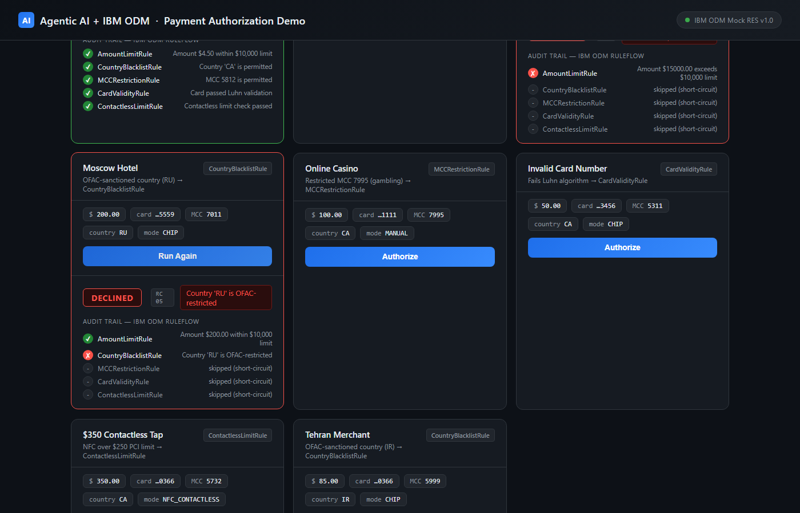

# Agentic AI + IBM ODM — Payment Authorization

> **AI Agent handles unstructured input → extracts intent → IBM ODM makes the auditable decision**

A portfolio project demonstrating how a **LangChain agent** (GPT-4 / Phi-3) integrates with **IBM Operational Decision Manager** to authorize payment transactions. The agent converts natural language into a structured payload; ODM runs a deterministic 5-rule ruleflow and returns a decision with a full audit trail.

---

## Live Architecture

```
Customer message (natural language)
        │
        ▼
[LangChain Agent]  ← Azure OpenAI GPT-4  /  Ollama Phi-3
        │  extracts: amount · card · merchant · MCC · country
        ▼
[authorize_payment tool]  ← odm_tool.py
        │  builds ISO 8583-style JSON payload
        ▼
[IBM ODM — HTDS REST endpoint]  ← mock_odm_server.py (or real RES)
        │  runs 5 rules sequentially · short-circuits on DECLINED
        │  returns: APPROVED / DECLINED + ISO 8583 code + audit trail
        ▼
[Agent formats response]
        │
        ▼
"Your $4.50 payment was approved at Java Joe. Auth code: B7964F."
```

---

## Web Dashboard

Run the server and open `http://localhost:9090` to interact with the rule engine live:



- **8 preset scenarios** — each targeting a specific ODM rule
- **Live audit trail** — see which rules fired, which passed, which short-circuited
- **Stats counter** — tracks approved vs declined in real time
- **Custom transaction form** — build any payload and authorize it

---

## Project Structure

```
Agentic_IMBODM/
├── mock_odm_server.py      FastAPI mock of IBM RES — 5-rule ruleflow + web UI
├── odm_tool.py             LangChain @tool wrapping the ODM HTTP call
├── agent.py                AgentExecutor (Azure OpenAI GPT-4 or Ollama Phi-3)
├── main.py                 Batch demo — 6 test scenarios
├── cli.py                  Interactive chat CLI  (--no-llm for direct ODM mode)
├── mcp_odm_server.py       MCP server — exposes ODM as a Claude Desktop tool
├── requirements.txt
├── .env.example
├── web/
│   └── index.html          Single-file dashboard (vanilla JS, dark theme)
├── java/
│   ├── TransactionRequest.java          BOM input class
│   ├── AuthorizationResponse.java       BOM output class
│   ├── PaymentAuthorizationResource.java  HTDS REST endpoint
│   └── PaymentAuthorizationRules.brl    BAL rules (Decision Center syntax)
└── tests/
    └── test_mock_odm.py    21 pytest tests · all passing
```

---

## Quick Start

### 1. Install dependencies

```bash
pip install -r requirements.txt
```

### 2. Configure environment

```bash
cp .env.example .env
# Add Azure OpenAI credentials — or set LLM_MODE=ollama for local inference
```

### 3. Start the mock ODM server + web UI

```bash
uvicorn mock_odm_server:app --port 9090 --reload
```

Open **http://localhost:9090** in your browser.

### 4. Run the batch demo

```bash
python main.py
```

### 5. Interactive chat (requires LLM credentials)

```bash
python cli.py
# You: Pay $4.50 at Java Joe Coffee Shop, card ending in 4532
# Agent: Your $4.50 payment at Java Joe was approved. Auth code: B7964F.

# Test ODM rules directly — no LLM needed:
python cli.py --no-llm
```

### 6. Run tests

```bash
pytest tests/test_mock_odm.py -v
# 21 tests — covers all 5 rules + short-circuit behavior
```

---

## The 5 ODM Rules

Rules execute **sequentially** inside a BAL ruleflow. First `DECLINED` result **short-circuits** — subsequent rules are skipped.

| # | Rule | Trigger | ISO 8583 Code |
|---|------|---------|---------------|
| 1 | `AmountLimitRule` | `amount > $10,000 CAD` | `05` — Do Not Honor |
| 2 | `CountryBlacklistRule` | OFAC-sanctioned country (`KP IR CU SY RU BY`) | `05` — Do Not Honor |
| 3 | `MCCRestrictionRule` | Restricted MCC — `7995` gambling · `9754` lottery | `57` — Not Permitted |
| 4 | `CardValidityRule` | Card number fails Luhn algorithm | `14` — Invalid Card Number |
| 5 | `ContactlessLimitRule` | NFC/tap transaction > `$250 CAD` (PCI-DSS) | `61` — Exceeds Withdrawal Limit |

The audit trail in every response shows each rule's name, result (`PASS` / `DECLINED`), and message — matching what IBM Decision Center would expose in its execution trace.

---

## LLM Modes

| Mode | `.env` setting | Notes |
|------|---------------|-------|
| Azure OpenAI GPT-4 | `LLM_MODE=azure` | Highest accuracy for intent extraction |
| Ollama Phi-3 | `LLM_MODE=ollama` | Local, zero API cost, lower latency |

---

## MCP Server (Claude Desktop)

Exposes IBM ODM as an MCP tool so Claude Desktop (or any MCP client) can call it directly:

```bash
python mcp_odm_server.py
```

Add to `claude_desktop_config.json`:

```json
{
  "mcpServers": {
    "odm-payment": {
      "command": "python",
      "args": ["C:/path/to/Agentic_IMBODM/mcp_odm_server.py"]
    }
  }
}
```

---

## Connecting to Real IBM ODM

Change one line in `.env` — no code changes needed:

```env
ODM_ENDPOINT=http://your-odm-server:9080/DecisionService/rest/PaymentAuthorizationRuleApp/1.0/PaymentAuthorizationRuleset/1.0
```

The mock and real RES share the same JSON contract. The Java source in `java/` shows the full BOM + BAL rules for deployment in Decision Center.

---

## Skills Demonstrated

### Agentic AI Layer
`LangChain` · `LangGraph` · `AgentExecutor` · `Azure OpenAI (GPT-4)` · `MCP (Model Context Protocol)` · `Ollama / Phi-3` · `FastAPI` · `RAG (ChromaDB)`

### IBM ODM Layer
`BOM / XOM design` · `Decision Center` · `Rule Execution Server (RES)` · `HTDS REST` · `BAL` · `Ruleflows`

### Integration Pattern
AI Agent + BRMS hybrid architecture · Deterministic guardrails for LLM decision systems · Agentic payment authorization pipelines

---

## One-Line Interview Answer

> *"I build systems where the AI agent handles ambiguity and natural language, and IBM ODM handles compliance and auditability. The agent extracts intent — ODM makes the decision."*

---

*[Reza (Ray) Aliyari](https://github.com/AliyariGit) · rezaaliyari@gmail.com*
